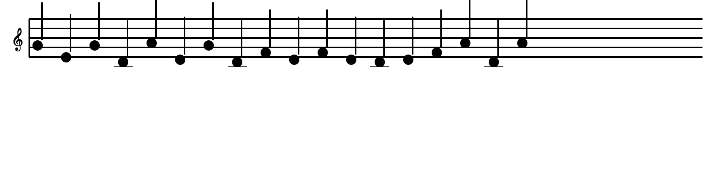

# keyboard-music

**Play piano notes while you type.** A small cross-platform background tool that listens to keyboard input and plays notes through FluidSynth + a SoundFont piano. Default config: **4-row piano layout** (numbers = black keys, QWERTY = white keys, ASDF = black keys, ZXCV = white keys, with `0` at the far right of the number row producing the highest pitch in that row), sustain pedal always on, central C register.

[](LICENSE)
[](pyproject.toml)
[](#installation)
[](tests/)

---

<p align="center">
  
</p>

## What it does

Every key you press becomes a piano note. The defaults are tuned for a "background piano" experience: 4-row piano layout (numbers are black keys, `q w e r t y u` = do re mi fa sol la si on the white-key row directly below), sustain always on so released notes keep ringing, and a concert-hall reverb so the sound feels like a real instrument. The 1.2 GB SoundFont (Salamander Grand Piano V3) downloads automatically on first run.

## Quick start

### Pre-built macOS executable

```bash
# Download keyboard-music.app.zip from the Releases page, unzip, double-click.
# On first run it will ask for Accessibility permission (one-time).
```

### From source

```bash
git clone https://github.com/laitingyou/keyboard-music.git
cd keyboard-music
python3 -m venv .venv && source .venv/bin/activate
pip install -e .
brew install fluid-synth        # macOS only; apt install on Linux
python main.py
```

Press some letters. You should hear piano. A Tk window shows the notes on a treble staff as you play.

## Features

- **All keys map to notes** — every printable key, plus Space, Enter, Backspace, Tab, Esc, F1–F12.
- **Position-based mapping** — lower-left keys are lower-pitched, upper-right keys are higher-pitched.
- **Piano-layout by default** — 4-row black/white key layout that mirrors a real piano (numbers = black keys, QWERTY = white keys, ASDF = black keys, ZXCV = white keys). `--mapping chromatic` for one-semitone-per-letter; `--mapping pentatonic` for random-text-friendly mode (no F or B).
- **Sustain always on** by default — released notes keep ringing. Use `Ctrl + Alt + P` to panic-silence.
- **Live staff-notation window** — a small Tk window draws each note on a treble staff in real time. Disable with `--no-visualizer`.
- **Octave shift** — `Up` / `Down` arrows transpose the keyboard by an octave at a time, with the new offset logged on stderr.
- **Auto sample-rate matching** — the tool queries your CoreAudio device's actual rate on startup, so it works whether your speakers run at 44.1 kHz or 48 kHz.
- **Realistic piano sound** via the [Salamander Grand Piano V3](https://freepats.zenvoid.org/Piano/SalamanderGrandPiano/) SoundFont (CC-BY-3.0, auto-downloaded as a 310 MB archive on first run, expands to 1.2 GB).
- **macOS executable bundle** — `BUNDLE_SOUNDFONT=1 build/build.sh` produces a self-contained 1.2 GB bundle you can copy to any Mac. See [build/README.md](build/README.md).

## Installation

### macOS

```bash
bash scripts/install_macos.sh
```

The script installs `fluid-synth` via Homebrew, the Python package in editable mode, and **also installs the Claude Code skill** (`keyboard-music-packaging`) to `~/.claude/skills/`. Restart any active Claude Code session to load it.

### Windows

```powershell
powershell -ExecutionPolicy Bypass -File scripts\install_windows.ps1
```

Uses Chocolatey if available; otherwise walks you through a manual FluidSynth install. Also installs the Claude Code skill to `%USERPROFILE%\.claude\skills\`.

### Linux

```bash
sudo apt install fluidsynth
pip install -e .
```

## Running

```bash
keyboard-music
```

### macOS Accessibility permission

macOS requires you to grant Accessibility permission to your terminal app before pynput can monitor keystrokes. The tool prints instructions on the first run. Easiest workflow:

```bash
keyboard-music --wait-permission
```

This polls for the grant and resumes once you toggle Accessibility on in **System Settings → Privacy & Security → Accessibility**.

### CLI flags

```
--mapping {pentatonic,pentatonic_minor,chromatic,piano}   default: piano
--soundfont PATH                                    skip auto-download; use this SF2
--sustain-key {left,right,either}                   default: either
--base-midi INT                                     default: 60 (middle C). Range [0, 80]
--redownload                                        re-download the SoundFont
--no-sustain                                        disable sustain entirely (Shift becomes a normal modifier)
--no-sustain-on-start                               start with sustain pedal up (Shift acts as momentary pedal)
--no-effects                                        disable built-in reverb + chorus (dry sound)
--velocity-dynamic                                  attack-based velocity (fast taps loud, long holds gentle)
--no-visualizer                                     no staff-notation window (headless)
--wait-permission                                   macOS: poll for Accessibility grant
--verbose, -v                                       debug logging
--list-keys                                         print the key→MIDI table and exit
```

### Examples

```bash
keyboard-music                                       # the default — piano layout, sustain on
keyboard-music --mapping chromatic                   # one semitone per letter (q=C, w=C#, ...)
keyboard-music --mapping pentatonic                  # friendlier for random typing (no F/B)
keyboard-music --no-sustain-on-start                 # Shift acts as momentary pedal
keyboard-music --soundfont ~/Downloads/other.sf2     # use a different SoundFont
keyboard-music --no-visualizer                       # headless mode (no window)
```

## How keys map to notes

Four mapping modes are available; default is `piano`.

### `--mapping piano` (default)

Four physical keyboard rows map to alternating black/white keys, mirroring a real piano layout (with `0` at the far right of the number row producing that row's highest pitch):

| Row | Keys | Key type | Default range (`--base-midi 60`) |
|---|---|---|---|
| Number row | `1 2 3 4 5 6 7 8 9 0` | black keys | C#4 → A#5 |
| Top letters | `q w e r t y u i o p` | white keys | C4 → E5 |
| ASDF row | `a s d f g h j k l ;` | black keys | C#3 → A#4 |
| ZXCV row | `z x c v b n m , . /` | white keys | C3 → E4 |

Pressing `q` then `1` plays C4 then C#4 — a half-step, just like the real piano. Run `keyboard-music --list-keys --mapping piano` for the full table.

### `--mapping chromatic`

Each letter maps to one semitone. Position in the alphabet = pitch (lower-left = lower pitch, upper-right = higher). So:

```
q w e r t y u i o p  →  do re mi fa sol la si do re
a s d f g h j k l     →  do re mi fa sol la si do re
z x c v b n m         →  do re mi fa sol la si do
```

The numbers row, `-`, `=`, `[`, `]`, `\`, `;`, `'`, `,`, `.`, `/` and the special keys (Space, Enter, F1–F12) all produce notes too. Run `keyboard-music --list-keys` for the full table.

### `--mapping piano`

Four physical keyboard rows map to alternating black/white keys, mirroring a real piano layout (with `0` at the far right of the number row producing that row's highest pitch):

| Row | Keys | Key type | Default range (`--base-midi 60`) |
|---|---|---|---|
| Number row | `1 2 3 4 5 6 7 8 9 0` | black keys | C#4 → A#5 |
| Top letters | `q w e r t y u i o p` | white keys | C4 → E5 |
| ASDF row | `a s d f g h j k l ;` | black keys | C#3 → A#4 |
| ZXCV row | `z x c v b n m , . /` | white keys | C3 → E4 |

Pressing `q` then `1` plays C4 then C#4 — a half-step, just like the real piano. Run `keyboard-music --list-keys --mapping piano` for the full table.

## Sustain behavior

- **Default**: sustain pedal always down. Released notes keep ringing until you `Ctrl + Alt + P` to panic.
- **`--no-sustain-on-start`**: sustain pedal starts up. Hold `Shift` to sustain, release to clear.
- **`--no-sustain`**: sustain is disabled entirely. Shift becomes a normal modifier.

`Ctrl + Alt + P` is the panic hotkey — silences everything currently ringing. Safe to spam.

## Transpose (octave-shift)

The keyboard covers 4 octaves by default. To reach lower or higher registers:

- **↑ (Up arrow)** — shift the keyboard up one octave.
- **↓ (Down arrow)** — shift the keyboard down one octave.

The current shift is logged on stderr (`transpose: +12 semitones`). Notes already ringing when you transpose are released at their original MIDI, so no stuck notes.

## Sound realism

The default config is tuned for realism on top of the Salamander Grand Piano V3 samples (88 keys × 16 velocity layers, 48 kHz / 24-bit — the best free piano SF2):

- **Velocity dynamics**: every note gets a ±14 velocity jitter by default, mimicking how a real player never hits a key twice with the same force. `--velocity-dynamic` enables attack-based dynamics (35 ms probe delay).
- **Reverb**: a concert-hall preset (room-size 0.85, damp 0.3, level 0.5) — big, bright, wide. `--no-effects` disables reverb/chorus entirely for a dry studio sound.
- **Chorus**: 3 voices, depth 1.5, level 0.25 — subtle stereo widening.

Tweak further by editing `_DEFAULT_SETTINGS` in `synth.py`.

To go beyond the free ceiling (Salamander is it), pass `--soundfont PATH` to point at any other SF2 you have (commercial pianos like Keyscape, or any GM soundfont).

## Troubleshooting

### No sound

1. **macOS**: Did you grant Accessibility permission? Try `keyboard-music --wait-permission`.
2. **System audio**: Is your output device working? `fluid-synth` requires the same library path that `afplay` uses; if `afplay /tmp/foo.wav` works but the tool doesn't, the issue is in the tool.
3. **libfluidsynth missing**: install it via your package manager (`brew install fluid-synth`, `choco install fluidsynth`, `apt install fluidsynth`).

### Stuck notes

Press `Ctrl + Alt + P` to panic-silence. If that doesn't work, kill the process.

### Latency / crackling

Edit `synth.py` and bump `period-size` to 128 or 256, then rebuild. Lower latency = more CPU = more crackle risk.

### Wrong SoundFont

`keyboard-music --soundfont /path/to/your.sf2`.

### Re-download SoundFont

`keyboard-music --redownload`, or delete `~/.keyboard-music/piano.sf2` and the next launch fetches a fresh copy.

## Building a standalone executable (macOS)

See [`build/README.md`](build/README.md). Produces `dist/keyboard-music/`, a self-contained macOS bundle — no Homebrew, no Python install needed on the target machine.

```bash
build/build.sh                  # 41 MB; downloads SF2 on first run
TARGET_ARCH=arm64 build/build.sh        # native M1
TARGET_ARCH=universal2 build/build.sh   # one bundle for both
BUNDLE_SOUNDFONT=1 build/build.sh       # ship the 1.2 GB SF2 inside the bundle
```

## Architecture

| File | Role |
|---|---|
| `main.py` | CLI entry, signal handling, lifecycle |
| `synth.py` | libfluidsynth ctypes wrapper, low-latency settings, sample-rate probe, bundled-lib lookup |
| `mapping.py` | QWERTY → MIDI table (chromatic, pentatonic, piano-row layouts) |
| `sustain.py` | Per-key state machine (IDLE / ACTIVE / SUSTAINED) |
| `listener.py` | pynput adapter, panic hotkey tracking, octave-shift arrows |
| `soundfont.py` | Auto-download + cache + bundled-path fallback for the SF2 |
| `permissions.py` | macOS Accessibility detection + wait-for-grant helper |
| `visualizer.py` | Tk staff-notation window, thread-safe queue, geometry helpers |
| `errors.py` | Exception hierarchy |
| `tests/` | 79 unit tests (mapping, sustain state machine, soundfont cache, visualizer geometry) |
| `scripts/` | Install scripts (mac / Windows) + dylib bundling + SF2 bundling |
| `build/` | PyInstaller spec, build.sh, build docs |

Threading model: pynput runs the keyboard listener on its own thread; the Tk visualizer owns the main thread; FluidSynth calls are serialized through a `threading.Lock`.

## Roadmap / not yet implemented

- **MIDI-out mode** (`--midi-out`) — forward keystrokes as MIDI to a DAW (Logic, GarageBand, Pianoteq) for access to commercial piano libraries. Currently a TODO; see `build/README.md` for the planned interface.
- **Per-platform bundled executable** — Windows and Linux builds.
- **Configuration file** — `~/.keyboard-music/config.toml` for users who want to tweak without command-line flags.

## Contributing

See [CONTRIBUTING.md](CONTRIBUTING.md). Bug reports → GitHub issues. Pull requests welcome. By participating you agree to follow the [Code of Conduct](CODE_OF_CONDUCT.md).

## License

[MIT](LICENSE) © 2026 laitingyou.

The bundled Salamander Grand Piano V3 SoundFont is CC-BY-3.0 by Alexander Holm.

## Acknowledgments

- [FluidSynth](https://www.fluidsynth.org/) — SoundFont synthesizer
- [Salamander Grand Piano V3](https://freepats.zenvoid.org/Piano/SalamanderGrandPiano/) — the piano SoundFont, by Alexander Holm
- [pynut]([pynut](https://pynput.readthedocs.io/)) — keyboard/mouse input library
- [PyInstaller](https://pyinstaller.org/) — executable bundling